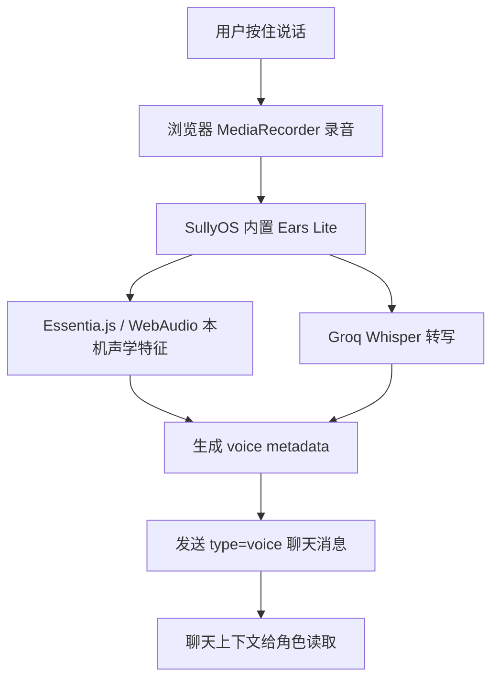

# SullyOS Ears Lite 语音画像方案

本文档记录 SullyOS fork 当前采用的语音消息方案。原始 `Silis-Aliya/ears` 只作为思路参考：我们借鉴“转写 + 声学特征 + 个人 baseline + 给角色的声音线索”这条链路，但不再要求用户部署或连接原版 ears 服务。

当前 V1 的目标很简单：手机和电脑都能在 SullyOS 里直接按住录音，Groq Whisper 负责转写，Essentia.js / WebAudio 在本机提取轻量声音特征，然后把结果写进这条 `voice` 消息的 metadata，角色在聊天历史里能读到。

---

## 1. 当前架构



### V1 必需

- 麦克风权限：`navigator.mediaDevices.getUserMedia({ audio: true })`。
- 浏览器录音：`MediaRecorder`。
- Groq API Key：用于 Whisper 转写。
- 本机轻量分析：`utils/earsLite.ts` 用 Essentia.js / WebAudio 提取音量、停顿、亮度、粗略 pitch、波动等特征。

### V1 不需要

- 不需要部署 `Silis-Aliya/ears`。
- 不需要填写公网 Ears 服务地址。
- 不需要电脑一直开着给手机当后端。
- 不做实时通话监听。
- 不在手机本地跑大型声纹、年龄、性别、情绪模型。

---

## 2. 数据进入角色上下文

每条用户语音会被发成 `type: 'voice'` 消息，并写入：

```ts
metadata: {
  transcript: string;
  audioUrl?: string;
  durationSec?: number;
  voice: {
    source: 'ears-lite';
    provider: 'SullyOS Ears Lite + Essentia.js + Groq';
    emotion?: string;
    confidence?: number;
    hint?: string;
    relative?: string;
    baselineProgress?: string;
    features?: Record<string, number | string | null>;
  };
}
```

聊天 prompt 中给角色看的格式保持简短：

```text
[时间] [聊天语音] 用户名发来一条语音。
转写：……
声音线索：情绪=…；置信度=…；提示=…；相对个人基线=…
```

如果只有 Groq 可用，角色至少能看到转写和 Ears Lite 的轻量线索。腾讯云 / 讯飞没有配置时，不显示它们才会提供的身份或长期画像字段。

---

## 3. Ears Lite 会分析什么

Ears Lite 不是“真人耳朵”，也不是强情绪识别模型。它做的是低成本声学估计：

- 时长、采样率。
- 平均能量 / 音量波动。
- peak / 可能爆音。
- 停顿比例。
- 粗略基频 pitch、pitch range、pitch jitter。
- 亮度 brightness。
- 过零率 zero crossing rate。
- 相对个人 baseline 的粗略变化。

情绪字段是由这些特征映射出的提示，适合作为“听起来像……”的辅助线索，不应该当成确定判断。

---

## 4. 后续增强位

### 腾讯云说话人识别

用途：判断这条语音大概率是不是机主本人。

建议状态：

- `matched`：像机主，可以参与 baseline 更新。
- `unmatched`：不像机主，不写入机主声音画像。
- `uncertain`：音频太短、太吵、分数接近阈值或服务失败。
- `not_enrolled`：还没建声纹。

### 讯飞声音特征

用途：建档或抽样时给“年龄段 / 性别听感倾向 / 声音描述”提供参考。

建议只在这些场景调用：

- 初次声音画像建档。
- 用户手动要求重新分析声音画像。
- 连续疑似换人，需要复核。

不要每条语音都跑年龄 / 性别听感，避免成本、隐私和误判。

---

## 5. 手机负担

普通语音消息负担很低，接近微信语音消息：

- 录音几秒到几十秒。
- 浏览器编码成 WebM / MP4 / Ogg。
- 本机跑轻量 WebAudio / Essentia 特征。
- 上传一次音频给 Groq 转写。

这不是持续监听，也不是实时大模型推理，所以正常语音消息不会明显让手机过热。通话模式以后如果要做，也应采用抽样策略，而不是每秒持续分析。

---

## 6. 当前验收标准

- 设置页只需要 Groq Key 就能开启 V1。
- 手机和电脑访问同一个 SullyOS 站点时都能录音发送。
- Groq / Ears Lite 配置存进 `os_api_config`，声音基线存进 `sully_ears_lite_baseline_v1`，二者都会随完整导入导出和 QuickSync 增量设置快照迁移到手机端。
- 没有 Groq Key 时给明确提示。
- 发送后的语音消息有可播放的语音条和转写文本。
- 角色聊天历史中能看到语音转写和声音线索。
- 原版 `Silis-Aliya/ears` 服务不是运行依赖。
---

## 7. Cloud voice worker

腾讯云 / 讯飞不从浏览器直连，走主代理 Worker：

- `POST /voice/tencent/enroll`
- `POST /voice/tencent/verify`
- `POST /voice/xfyun/profile`

前端会把录音转成 `16k / 16bit / mono`：

- 腾讯云使用 WAV base64。
- 讯飞使用 PCM base64。

Worker 环境变量：

- `TENCENT_SECRET_ID`
- `TENCENT_SECRET_KEY`
- `TENCENT_ASR_REGION`，可选，默认 `ap-guangzhou`
- `TENCENT_VOICE_PRINT_ID`，可选，前端也可以传 `VoicePrintId`
- `TENCENT_VOICE_GROUP_ID`，可选，注册声纹时使用
- `XFYUN_APP_ID`，可选，前端也可以传 AppId
- `XFYUN_API_KEY`
- `XFYUN_API_SECRET`

角色历史里只注入简短结果：

```text
声音：情绪=...；可信度=...；提示=...；身份=像机主本人；声音画像=偏女声，中青年听感
```

完整 `features / relative / speakerVerification / voiceProfile` 仍保存在该条 `metadata.voice` 里，供调试、导入导出和后续声音画像使用。
